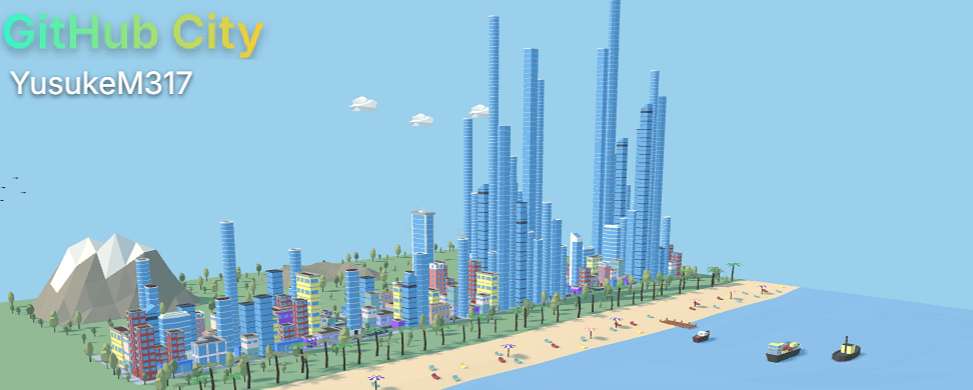

  

  
  
  
  
  

 
<h1> Technical Skills</h1>

### Programming Languages

### Web & Frameworks

### Databases & Cloud

### Tools

 
<h1>  GitHub Stats </h1>

  <!-- GitHub Overview -->
  

    <h3>🚀 Overview</h3>

  

  <!-- GitHub  -->
  

    <h3> 🐍 Contributions Eating Snake </h3> 
  

  <!-- GitHub City -->
  

    <h3>🌆 GitHub City</h3>
    
  

 

